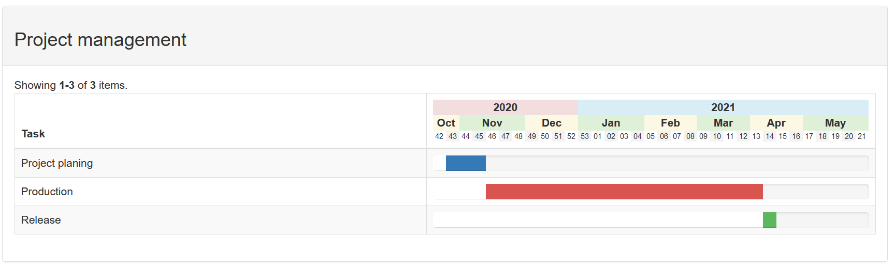

# yii2-gantt-column

[](https://www.yiiframework.com/)

[](//packagist.org/packages/rottriges/yii2-gantt-column) [](//packagist.org/packages/rottriges/yii2-gantt-column) [](//packagist.org/packages/rottriges/yii2-gantt-column) [](//packagist.org/packages/rottriges/yii2-gantt-column)

Gantt-Column widget for yii2 grid extends the data column. It could be used for project management or other planings. for Yii Framework 2.0. The widget incorporates with Bootstrap 3.x.



## Installation

The preferred way to install this extension is through [composer](http://getcomposer.org/download/).

### Prerequisite
You must set the `minimum-stability` to `dev` in the **composer.json** file in your application root folder before installation of this extension.


### Install

You can directly run

```
$ php composer.phar require rottriges/yii2-gantt-column "1.0.*"
```

or  you add the following to to the ```require``` section of your `composer.json` file.

```
"rottriges/yii2-gantt-column": "1.0.*"
```

## Usage

#### Model with dataProvider:
```php
namespace app\models;

use yii\data\ArrayDataProvider;

class GanttTest extends \yii\base\Model
{
  public function getDataProvider()
  {
      $testArray = [
        [
          'task' => 'Project planing',
          'type' => 'primary',
          'START_DATE' => '2020-10-19',
          'END_DATE' => '2020-11-07'
        ],
        [
          'task' => 'Production',
          'type' => 'danger',
          'START_DATE' => '2020-11-15',
          'END_DATE' => '2021-03-29'
        ],
        [
          'task' => 'Release',
          'type' => 'success',
          'START_DATE' => '2021-04-05',
          'END_DATE' => '2021-04-06'
        ],
      ];
     return new ArrayDataProvider([
          'allModels' => $testArray,
          'pagination' => [
              'pageSize' => 0,
          ],
        ]
      );
  }
}
```
#### View:
```php
use yii\grid\GridView;

echo GridView::widget([
  'dataProvider' => $model->dataProvider,
  'columns' => [
    [
      'attribute' => 'gantChart'
      'class' => 'rottriges\ganttcolumn\GanttColumn',
      'ganttOptions' => [
        // start or endDateRange can either be a static date (Y-m-d)
        // or an offset in weeks to the current date (-2, 0, 5, ...)
        // 'dateRangeStart' => '2019-10-31',
        // 'dateRangeEnd' => '2020-10-01',
        'dateRangeStart' => -4,
        'dateRangeEnd' => 28,
        'startAttribute' => 'START_DATE',
        'endAttribute' => 'END_DATE',
        // progressBarType [string | closure] possible values
        // primary, info, warning or danger.
        'progressBarType' => function($model, $key, $index) {
          return $model['type'];
        }
      ]
    ],
  ],
]);
```
